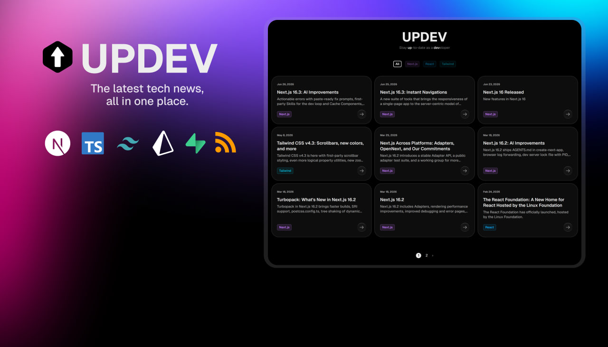

# UPDEV



> Stay up to date with the latest technology news in one place.

A platform that brings together the latest articles and updates from trusted technology websites, making it easier to stay informed without jumping between multiple websites.

🌐 Live Demo: https://updev-app.vercel.app/


## About

Every day, new updates and blog posts are published on the official websites of different technologies.

Keeping up meant constantly switching between multiple websites, wasting time, and still missing important updates.

UPDEV solves this by collecting the latest articles and updates from popular technology websites into a single, clean, and organized platform.

##  Features

- 📰 Aggregated RSS feeds
- 🗂️ Filter articles by category
- 📄 Pagination - browse through a clean, paginated feed
- 🔍 Clean and intuitive reading experience
- 🌐 Deployed on Vercel


## Tech Stack

| Layer | Technology |
|-------|------------|
| Frontend | Next.js |
| Language | TypeScript |
| Styling | Tailwind CSS |
| Database | Supabase (PostgreSQL) |
| ORM | Prisma |
| Data Source | RSS Feeds |
| Deployment | Vercel |

## Project Structure

```text
UPDEV/
├── app/               # Next.js App Router (pages, layouts, routes)
├── components/        # Reusable React components
├── lib/               # Utility functions, RSS fetching logic, and constants
├── prisma/            # Prisma schema and migrations
├── public/            # Static assets
├── types/             # TypeScript type definitions
├── next.config.ts     # Next.js configuration
├── prisma.config.ts   # Prisma configuration
└── vercel.json        # Vercel Cron Jobs configuration
```

## 🤝 Contributing

Contributions, issues, and feature requests are welcome!

Feel free to open an issue or submit a pull request.


## 👨‍💻 Author

Farhan Fadaei

- GitHub: https://github.com/FARHAN2324J
- LinkedIn: https://www.linkedin.com/in/farhan-fadaei
- Portfolio: https://farhan2324j.github.io/FarhanFadaei/
- Telegram: https://t.me/Feri3044

